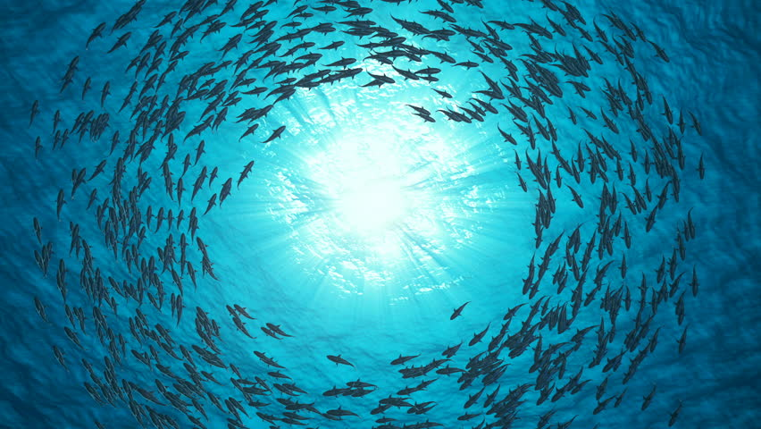

# Shark-Lessons
Teaching sharks to swim in circles with genetic algorithms :shark:



## What is this?
I recently found out about an algorithm, belonging to a larger class of evolutionary algorithms, known as the genetic algorithm (GA). These algorithms replicate the biological processes observed in everyday life such as natural selection and evolution. I thought it would be a fun quick project to create a small simulation, powered by a GA, to teach sharks to replicate the actions they commonly perform in nature - swimming in circles.

## How the algorithm works?
The genetic algorithm is composed of a few steps:
1. The first part of the algorithm involves calculating the fitness for each of the sharks in the simulation. The fitness is simply a metric for evaluating how well the shark is doing what I want it to do (in this case, swim in circles). I calculate the fitness based on the number of fish that each shark came into contact with during the duration of a single epoch. If a shark came in contact with the same fish again, this would not increase the fitness metric. I defined the metric this way because it would allow for the evolution of sharks that touch more fish, and therefore follow the circular pattern I have designed. Additionally, I normalize the fitness in order to retain the same number of sharks as in the original population when I perform the reproduction phase in a later part of the algorithm.
```javascript
fitness(){
        let maxFitness = 0;
        let summation = 0;
        for (let i = 0; i < this.population.length; i++){
            this.population[i].setFitness();
            maxFitness = Math.max(this.population[i].fitness, maxFitness);
            summation += this.population[i].fitness;
        }
        this.maxfitness = maxFitness;
        this.avgfitness = summation / this.population.length;
        // Normalize
        for (let i = 0; i < this.population.length; i++){
            this.population[i].fitness /= maxFitness;
        }
    }
```
2. The second part of the algorithm involved creating a mating population based on which sharks performed the best in the previous round. Sharks that performed the best were characterized by having the highest fitness values. This mating population will be used to create the new shark population for the next epoch. This mirrors the process of natural selection as individuals with a higher fitness have a higher probability of having offspring and continuing the survival of their genes.
```javascript
selection(){
        this.matingPool = [];
        for (let i = 0; i < this.population.length; i++){
            let n = this.population[i].fitness * 100;
            for (let j = 0; j < n; j++){
                this.matingPool.push(this.population[i]);
            }
        }
    }
```
3. The third part of the algorithm involved the reproduction phase where a new population was generated by randomly selecting two sharks from the mating pool, performing genetic crossover, and then inserting the newly created shark into the new population.
```javascript
reproduction(){
        let newpopulation = [];
        for (let i = 0; i < this.population.length; i++){
            let parentA = random(this.matingPool).genes;
            let parentB = random(this.matingPool).genes;
            let child = this.crossover(parentA, parentB);
            newpopulation[i] = new Shark(
                this.spawn.x,
                this.spawn.y,
                child
            );
        }
        this.population = newpopulation;
    }
```
4. The final part of the algorithm involved the mutation stage. Mutation involves randomly changing the genes of a shark. Since the genes are used to dictate the shark's movement, this helps to prevent early algorithmic convergence and keep biodiversity in the population.
```javascript
mutation(){
        for (let i = 0; i < this.population.length; i++){
            for (let j = 0; j < this.population[i].genes.genes.length; j++){
                if (random(1) < this.mutationRate){
                    this.population[i].genes.genes[j] = p5.Vector.random2D().setMag(0.17);
                }
            }
        }
    }
```

## Results:
- ***Epoch 0***:   Maximum Fitness = 5  | Average Fitness = 0.8
  
  
- ***Epoch 10***:  Maximum Fitness = 14 | Average Fitness = 6.52 

  
- ***Epoch 25***:  Maximum Fitness = 18 | Average Fitness = 10.28

  
- ***Epoch 50***:  Maximum Fitness = 22 | Average Fitness = 12.12

    
- ***Epoch 100***: Maximum Fitness = 23 | Average Fitness = 10.8

  
- ***Epoch 130***: Maximum Fitness = 25 | Average Fitness = 14.52

  
- ***Epoch 250***: Maximum Fitness = 25 | Average Fitness = 15.24

  
